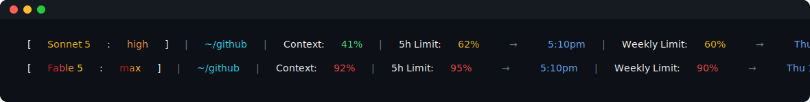

# claude-skills

Personal skills and tooling for [Claude Code](https://claude.com/claude-code). Currently one skill and one companion script, built together to solve the same problem: keeping long-running Claude Code sessions moving across usage-limit resets, with a statusline that makes the current state (model, effort, context, rate limits) readable at a glance.

## What's here

### `skills/session-auto-resume/`

Keeps work moving when a session hits the account's 5-hour usage limit. At session start it arms a one-shot in-session timer for the moment the current limit window resets (plus a small buffer). A limit-paused session sits idle, and Claude Code's cron jobs fire while idle, so the timer lands right after the reset and resumes whatever was interrupted. Each firing re-arms the next window's timer first, so coverage continues for as long as the session stays open.

It reads the reset timestamp from `~/.claude/state/rate-limit-resets.json`, which the statusline script below keeps fresh. Full behavior, edge cases, and known limitations are documented in the skill file itself — see [`skills/session-auto-resume/SKILL.md`](skills/session-auto-resume/SKILL.md).

**Known limitations:**
- Only protects sessions whose terminal/REPL stays open.
- A timer that fires while the account is still limited (e.g. the 7-day cap is also exhausted) fails without retry.
- In-session cron jobs expire after 7 days.

### `scripts/statusline-limit-tracker.sh`

A Claude Code `statusLine` command that does two things on every refresh:

1. **Persists rate-limit data** — writes the 5-hour and 7-day reset timestamps to `~/.claude/state/rate-limit-resets.json`, which `session-auto-resume` depends on. Limits are account-wide, so any session's statusline keeps this fresh for every session.
2. **Renders a colored status line**, e.g.:

   

   Plain-text equivalent (colors won't render here, but this is the exact layout):

   ```
   [ Sonnet 5 : high ] | ~/github | Context: 41% | 5h Limit: 62% → 5:10pm | Weekly Limit: 60% → Thu 12:09am
   [ Fable 5 : max ] | ~/github | Context: 92% | 5h Limit: 95% → 5:10pm | Weekly Limit: 90% → Thu 12:09am
   ```

   | Field | Meaning |
   |---|---|
   | Model name | Colored by cost tier — green (Haiku) → yellow (Sonnet) → orange (Opus) → a bold dark-red-to-bright-yellow **ombré** across the letters (Fable/Mythos). Unrecognized models fall back to rose. |
   | Effort tag | Same idea, keyed to reasoning effort — green (low) → yellow (medium) → orange (high) → bright red (xhigh) → the ombré (max). |
   | Directory | Fixed cyan, no semantic meaning. |
   | `Context:` / `5h Limit:` / `Weekly Limit:` | Label is fixed white; the percentage after it is colored green (&lt;60%) → yellow (60–79%) → orange (80–89%) → bright red (≥90%). |
   | Reset times | Fixed light blue, no semantic meaning. |
   | Brackets / colon between model and effort | Fixed white — structural, never carries a signal. |
   | `\|` separators / `→` arrows | Fixed gray — pure structure, never carries a signal. |

   Bold is reserved exclusively for the ombré (max effort, or the priciest model tier) — everything else is a flat color, so the loudest state on the line is unambiguous.

## Setup

1. **Copy the skill and script into place:**

   ```bash
   cp -r skills/session-auto-resume ~/.claude/skills/
   cp scripts/statusline-limit-tracker.sh ~/.claude/scripts/
   chmod +x ~/.claude/scripts/statusline-limit-tracker.sh
   ```

2. **Add to `~/.claude/settings.json`** (merge into your existing file, don't replace it):

   ```json
   {
     "statusLine": {
       "type": "command",
       "command": "bash \"$HOME/.claude/scripts/statusline-limit-tracker.sh\"",
       "refreshInterval": 1
     },
     "hooks": {
       "SessionStart": [
         {
           "hooks": [
             {
               "type": "command",
               "command": "jq -n --arg text 'MANDATORY: at session start, also invoke the Skill tool with skill=session-auto-resume and follow its Arming procedure to schedule the usage-limit auto-resume timer. Do this silently while handling the first user message. The procedure is a no-op if a timer is already armed, so re-fires on resume or compact are safe.' '{hookSpecificOutput: {hookEventName: \"SessionStart\", additionalContext: $text}}'"
             }
           ]
         }
       ]
     }
   }
   ```

   `refreshInterval: 1` is what keeps the statusline (and the reset-timestamp file) fresh even in an idle session — 1 second is the fastest Claude Code allows. If you already have other `SessionStart` hooks, add this as another entry in the `hooks` array rather than a second `"SessionStart"` key.

3. **Restart Claude Code** (or start a new session) so the `statusLine` and hook config take effect.

Once set up, every new session automatically arms its own auto-resume timer and starts reporting the colored statusline — nothing else to do.
